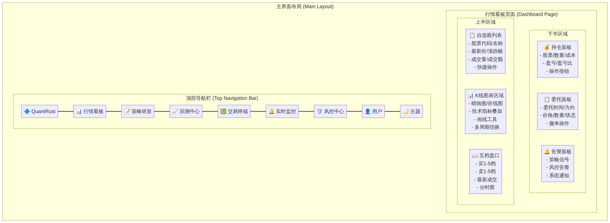
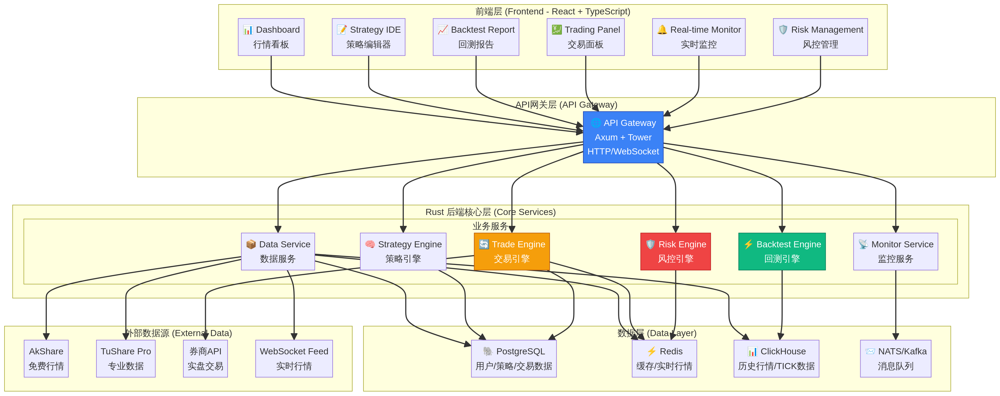
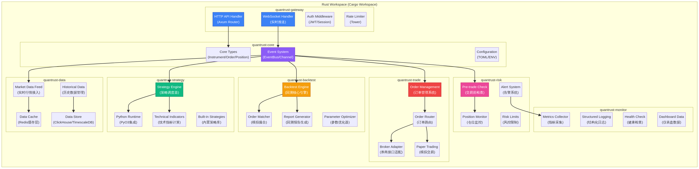
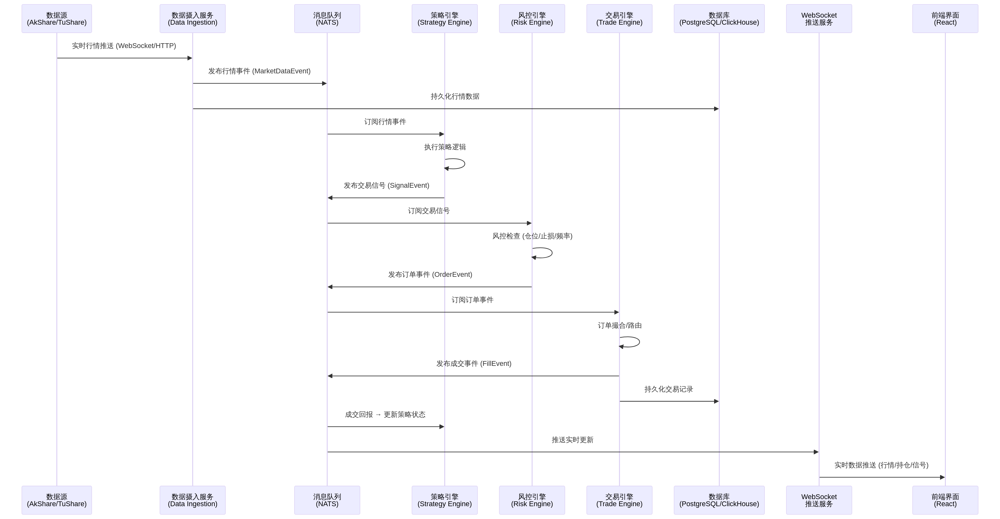
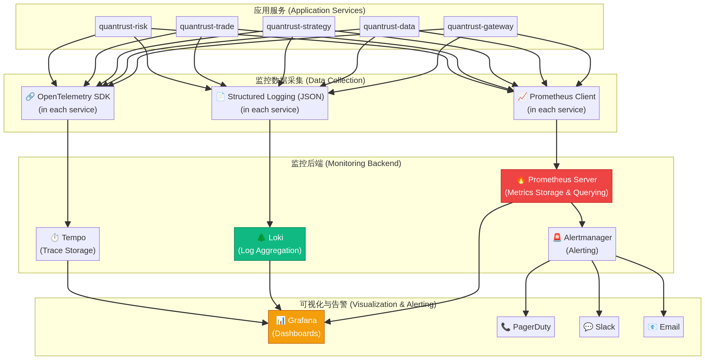
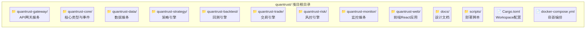

# QuantRust: A Professional A-Share Quantitative Trading Platform

## 1. Project Overview

**QuantRust** is a high-performance, professional-grade quantitative trading platform designed for the A-share market. It is built with a modern technology stack, featuring a **Rust-based backend** for ultimate performance and safety, and a **React-based frontend** for a rich, interactive user experience. The platform is designed to cater to individual quantitative traders, small investment teams, and finance students.

This document outlines the complete design of the QuantRust platform, covering product goals, feature specifications, UI/UX design, system architecture, and technical implementation details.

## 2. Product & Feature Design

The core philosophy is to provide a seamless, end-to-end experience for the entire lifecycle of a quantitative strategy, from initial idea to live trading.

**Key Features (MVP):**
- **Web-based IDE**: A powerful, browser-based code editor for developing trading strategies in Python.
- **High-Performance Backtesting**: A robust backtesting engine supporting both vectorized and event-driven modes to accurately evaluate strategy performance.
- **Real-time Paper Trading**: A realistic simulation environment connected to live market data to test strategies without financial risk.
- **Interactive Dashboard**: A TradingView-style interface for market data visualization, account monitoring, and trade execution.

> For a detailed breakdown of user stories, functional requirements, and the product roadmap, please refer to the **[Product Requirements Document](./docs/product_requirements.md)**.

## 3. UI/UX Design

The user interface is designed to be intuitive, data-rich, and highly responsive, drawing inspiration from leading platforms like TradingView and QMT. It will feature a dark theme to reduce eye strain during long trading sessions and a modular layout that users can customize.

### Main Interface Layout

The main dashboard is organized into logical sections for efficient workflow:
1.  **Top Navigation**: Quick access to all major modules.
2.  **Chart Area**: The central component for market analysis.
3.  **Watchlist & Order Book**: Real-time market overview.
4.  **Account & Order Management**: Panels for tracking positions, orders, and system alerts.

## 4. System Architecture

The backend is built on a Rust-based, event-driven microservices architecture. This design ensures high throughput, low latency, and excellent scalability, which are critical for financial trading systems.

**Core Principles:**
- **Performance & Safety**: Leveraging Rust to prevent common programming errors and achieve C-like performance.
- **Modularity**: Services are decoupled and communicate asynchronously via a NATS message queue.
- **Scalability**: Each service can be scaled independently based on its load.

> For a deep dive into the technology stack, microservice breakdown, and database schema, see the **[Backend System Architecture Design Document](./docs/backend_architecture.md)**.

### Rust Module Structure

The backend codebase is organized as a Cargo Workspace, promoting code reuse and clear separation of concerns.

## 5. Dataflow & Real-time Monitoring

### Event-Driven Dataflow

The system operates on a reactive data flow model. Market data, trading signals, and order statuses are propagated through the system as events, ensuring consistency and resilience.

### Observability

A comprehensive monitoring stack (Prometheus, Grafana, Loki) is integrated to provide deep insights into the system's health and performance in real-time.

> For specifics on event schemas, data pipelines, and key performance indicators (KPIs) for monitoring, please consult the **[Dataflow & Monitoring Design Document](./docs/dataflow_monitoring.md)**.

## 6. Project Structure

The repository is organized into distinct directories for the frontend, backend services, documentation, and deployment scripts.

