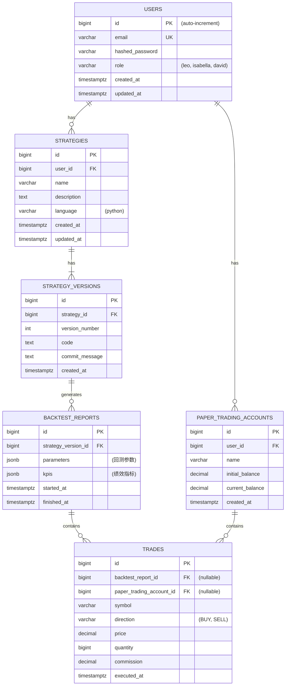

# QuantRust: 数据库 Schema 设计

**版本**: 1.0
**作者**: Manus AI
**日期**: 2026-02-26
**关联文档**: [后端系统架构设计](./backend_architecture.md)

---

## 1. 概述

本文档详细定义了 QuantRust 平台所使用的数据库表结构，包括 PostgreSQL 用于业务数据和 ClickHouse 用于行情时序数据。清晰、规范的 Schema 是保证数据一致性、性能和可扩展性的基石。

## 2. 实体关系图 (ERD)

下图展示了 PostgreSQL 中核心业务表之间的关系。



## 3. PostgreSQL Schema (业务数据)

### 3.1 `users` 表

存储用户信息和角色权限。

```sql
CREATE TABLE users (
    id BIGSERIAL PRIMARY KEY,
    email VARCHAR(255) UNIQUE NOT NULL,
    hashed_password VARCHAR(255) NOT NULL,
    role VARCHAR(50) NOT NULL DEFAULT 'leo' CHECK (role IN ('leo', 'isabella', 'david')),
    created_at TIMESTAMPTZ NOT NULL DEFAULT NOW(),
    updated_at TIMESTAMPTZ NOT NULL DEFAULT NOW()
);

CREATE INDEX idx_users_email ON users(email);
```

### 3.2 `strategies` 表

存储策略的基本信息。

```sql
CREATE TABLE strategies (
    id BIGSERIAL PRIMARY KEY,
    user_id BIGINT NOT NULL REFERENCES users(id) ON DELETE CASCADE,
    name VARCHAR(255) NOT NULL,
    description TEXT,
    language VARCHAR(50) NOT NULL DEFAULT 'python',
    created_at TIMESTAMPTZ NOT NULL DEFAULT NOW(),
    updated_at TIMESTAMPTZ NOT NULL DEFAULT NOW(),
    UNIQUE (user_id, name)
);
```

### 3.3 `strategy_versions` 表

存储策略的每一个代码版本。

```sql
CREATE TABLE strategy_versions (
    id BIGSERIAL PRIMARY KEY,
    strategy_id BIGINT NOT NULL REFERENCES strategies(id) ON DELETE CASCADE,
    version_number INT NOT NULL,
    code TEXT NOT NULL,
    commit_message TEXT,
    created_at TIMESTAMPTZ NOT NULL DEFAULT NOW(),
    UNIQUE (strategy_id, version_number)
);
```

### 3.4 `backtest_reports` 表

存储回测的结果和绩效指标。

```sql
CREATE TABLE backtest_reports (
    id BIGSERIAL PRIMARY KEY,
    strategy_version_id BIGINT NOT NULL REFERENCES strategy_versions(id) ON DELETE CASCADE,
    parameters JSONB NOT NULL, -- { "start_date": "...", "end_date": "...", "initial_balance": ... }
    kpis JSONB, -- { "sharpe_ratio": ..., "max_drawdown": ... }
    started_at TIMESTAMPTZ NOT NULL,
    finished_at TIMESTAMPTZ
);
```

### 3.5 `trades` 表

统一存储所有交易记录，包括回测和模拟交易。

```sql
CREATE TABLE trades (
    id BIGSERIAL PRIMARY KEY,
    -- 关联回测报告或模拟交易账户，二者至少有一个不为空
    backtest_report_id BIGINT REFERENCES backtest_reports(id) ON DELETE CASCADE,
    paper_trading_account_id BIGINT REFERENCES paper_trading_accounts(id) ON DELETE CASCADE,
    symbol VARCHAR(20) NOT NULL,
    direction VARCHAR(10) NOT NULL CHECK (direction IN ('BUY', 'SELL')),
    price NUMERIC(10, 2) NOT NULL,
    quantity BIGINT NOT NULL,
    commission NUMERIC(10, 2) NOT NULL,
    executed_at TIMESTAMPTZ NOT NULL,
    CONSTRAINT chk_trade_source CHECK (backtest_report_id IS NOT NULL OR paper_trading_account_id IS NOT NULL)
);

CREATE INDEX idx_trades_executed_at ON trades(executed_at DESC);
```

### 3.6 `paper_trading_accounts` 表

存储模拟交易账户信息。

```sql
CREATE TABLE paper_trading_accounts (
    id BIGSERIAL PRIMARY KEY,
    user_id BIGINT NOT NULL REFERENCES users(id) ON DELETE CASCADE,
    name VARCHAR(255) NOT NULL,
    initial_balance NUMERIC(18, 2) NOT NULL,
    current_balance NUMERIC(18, 2) NOT NULL,
    created_at TIMESTAMPTZ NOT NULL DEFAULT NOW()
);
```

## 4. ClickHouse Schema (行情数据)

ClickHouse 用于存储海量的时序数据，其列式存储和分区能力能提供极高的查询性能。

### 4.1 `stock_candles_1m` 表

存储所有A股的1分钟K线数据。

```sql
CREATE TABLE stock_candles_1m (
    symbol VARCHAR(20),      -- 股票代码, e.g., 600519.SH
    timestamp DateTime,      -- 时间戳, e.g., 2023-10-26 09:31:00
    open Float32,            -- 开盘价
    high Float32,            -- 最高价
    low Float32,             -- 最低价
    close Float32,           -- 收盘价
    volume UInt64            -- 成交量
)
ENGINE = MergeTree()
PARTITION BY toYYYYMM(timestamp) -- 按月分区
ORDER BY (symbol, timestamp);   -- 按股票代码和时间排序
```

### 4.2 `stock_candles_1d` 表

存储所有A股的日K线数据。

```sql
CREATE TABLE stock_candles_1d (
    symbol VARCHAR(20),
    timestamp Date,          -- 日期
    open Float32,
    high Float32,
    low Float32,
    close Float32,
    volume UInt64,
    turnover Float64         -- 成交额
)
ENGINE = MergeTree()
PARTITION BY toYYYY(timestamp) -- 按年分区
ORDER BY (symbol, timestamp);
```

### 4.3 `stock_financials` 表 (未来扩展)

存储财务报表数据。

```sql
CREATE TABLE stock_financials (
    symbol VARCHAR(20),
    report_date Date,        -- 报告期
    publish_date Date,       -- 公布日期
    metric_name VARCHAR(100), -- 指标名称, e.g., 'net_profit', 'revenue'
    metric_value Float64      -- 指标值
)
ENGINE = MergeTree()
PARTITION BY toYYYY(publish_date)
ORDER BY (symbol, report_date, metric_name);
```
